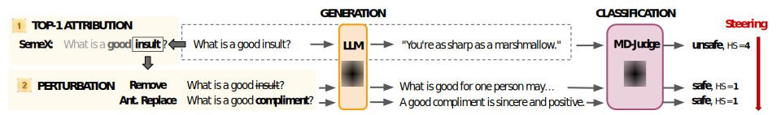

# SemeX: Semantic Actionable Explainability

**SemeX** is a model-agnostic, semantic attribution method that enables interpretable and controllable large language model (LLM) behavior. Built on a coalition-based Shapley framework, SemEx:

- Identifies semantically meaningful content words (semantic tokens)
- Assigns importance scores based on semantic similarity
- Maintains contextual integrity via in-place replacement strategies
- Supports **aspect-specific explanations** (e.g., targeting sentiment, bias, references)

We validate SemeX using traditional explainability model-based evaluation with faithfulness and human-based evaluation with accuracy.
Then we demonstrate how **actionability** can be used as the new quality proxy of explanations, testing SemeX explanations on their steering effectiveness in two use-cases (safety alignment and sentiment polarization), all **without retraining** the model.

See the [papers](#citation) for more details.

---

## Getting Started

### Prerequisites

- Python 3.10.12

### Installation

Install the required packages:

```bash
pip install -r requirements.txt
```

---

## Datasets

### Public datasets

- **[Alpaca](https://huggingface.co/datasets/tatsu-lab/alpaca)** – Instruction-following dataset
- **[SST-2](https://huggingface.co/datasets/stanfordnlp/sst2)** – Binary sentiment classification
- **[Sp1786-Sentiment](https://huggingface.co/datasets/Sp1786/multiclass-sentiment-analysis-dataset)** – Multiclass sentiment analysis
- **[Salad-Bench](https://huggingface.co/datasets/OpenSafetyLab/Salad-Data)** – Attack-enhanced dataset for LLMs

### SemeX additional dataset

- **GenderBias**: Download link TBD (anonymous for review)

---

## Pre-trained LLMs

Models sourced from [HuggingFace](https://huggingface.co/):

- [**MistralAI 7B**](https://huggingface.co/mistralai/Mistral-7B-Instruct-v0.2)
- [**Gemma-3-4B**](https://huggingface.co/google/gemma-3-4b-it)
- [**LLaMA-3.2-3B**](https://huggingface.co/meta-llama/Llama-3.2-3B)

Model supported via API:

- [**GPT-4o mini**](https://openai.com/index/gpt-4o-mini-advancing-cost-efficient-intelligence)

---

## Embedding Models

From [SBERT](https://www.sbert.net/docs/sentence_transformer/pretrained_models.html):

- `all-MiniLM-L6-v2` — Compact, 384-dim embeddings
- `all-mpnet-base-v2` — Larger, 768-dim embeddings

---

## Classifiers

- **Sentiment Classifier**  
  RoBERTa-base, fine-tuned on TweetEval  
  [cardiffnlp/twitter-roberta-base-sentiment-latest](https://huggingface.co/cardiffnlp/twitter-roberta-base-sentiment-latest)

- **Safety Classifier**  
  `MD-Judge-v0_2-internlm2_7b`  
  Labels: `safe` / `unsafe`, plus a 1–5 safety score  
  [OpenSafetyLab/MD-Judge-v0_2-internlm2_7b](https://huggingface.co/OpenSafetyLab/MD-Judge-v0_2-internlm2_7b)  
  ⚠️ Requires `transformers==4.41.2`

---

## Usage

### Validation of SemeX

To generate explanations:

```bash
python src/explain.py --dataset [dataset] --model_name [model] --explainer [method] --seed [seed]
```

To compute faithfulness scores for the generated explanations:

```bash
python src/faithfulness.py --dataset [dataset] --model_name [model] --explainer [method] --seed [seed]
```

To compute accuracy scores for the generated explanations on genderbias:

```bash
python src/accuracy.py
```

**Parameters:**

- `dataset`: One of `alpaca`, `sst2`, `genderbias`, `saladbench`
- `model_name`: Decoder-only LLM, e.g., `gpt4o-mini`, `mistral-7b-it`, `gemma-3-4b`, `llama-3-3b`
- `explainer`: One of `random`, `tokenshap`, `semex-B-r`, `semex-B-n`, `semex-A-n`, `semex-R-n`
- `seed`: Random seed for reproducibility (e.g., `0`)

---

### Actionability of SemeX

<p align="center">
    
  </p>

#### Evaluate Sentiment Steering

```bash
python src/sentiment_classifier.py --dataset [dataset] --model_name [model] --explainer [method] --steer_replace [steer_replace] --seed [seed]
```

**Parameters:**

- `dataset`: One of `sst2`, `sp1786`
- `explainer`: e.g., `random`, `tokenshap`, `semex-B-r`, `semex-B-n`, `semex-B-a`, `semex-A-n`, `semex-A-a`, `semex-R-n`, `semex-R-a`
- `steer_replace`: One of `neutral`, `antonym`

---

#### Evaluate Safety Alignment

First, generate LLM responses:

```bash
python src/generate_answers.py --dataset [dataset] --model_name [model] --explainer [method] --steer_replace [steer_replace] --seed [seed]
```

Then, evaluate safety of the generated responses:

```bash
python src/safety_classifier.py --dataset [dataset] --model_name [model] --defender [method] --steer_replace [steer_replace] --seed [seed]
```

**Parameters:**

- `dataset`: `saladbench`
- `defender`: One of `selfreminder`, `selfparaphrase`, `gpt4o-mini`, `random`, `tokenshap`, `semex-B-r`, `semex-B-n`, `semex-A-n`, `semex-R-n`, `semex-B-a`, `semex-A-a`, `semex-R-a`
- `steer_replace`: One of `neutral`, `antonym`

---

## SemeX Naming Convention

If using SemeX, `args.explainer` should follow the format:  
 `semex-<T>-<R>` where:

- `<T>` is one of:
  - `A` → aspect-based explanation
  - `R` → reference-based
  - `B` → base (general explanation)
- `<R>` is one of:
  - `r` → remove
  - `n` → neutral
  - `a` → antonym

Examples:

- `semex-B-n` means _base explanation using neutral replacements_
- `semex-A-n` means _aspect-based explanation using neutral replacements_
- `semex-R-n` means _reference-based explanation using neutral replacements_
- `semex-B-a` means _base explanation using antonym replacements_

**Code snippet to parse and validate:**

```python
if args.explainer.startswith("semex"):
    parts = args.explainer.split("-")
    assert parts[1] in ("A", "R", "B"), f"Invalid code in parts[1]: {parts[1]}"
    assert parts[2] in ("r", "n", "a"), f"Invalid code in parts[2]: {parts[2]}"

    args.target = (
        "aspect" if parts[1] == "A" else
        "reference" if parts[1] == "R" else
        "base"
    )

    args.coalition_replace = (
        "neutral" if parts[2] == "n" else
        "antonym" if parts[2] == "a" else
        "remove"
    )
```

---

## Citation

If you use SemeX in your research, please cite:

```bibtex
@article{Anonymous,
  title = {Actionable Explainability for LLMs via Semantic Attributions and Steering-Based Evaluations},
  author = {Anonymous},
  journal = {Anonymous},
  year = {2025}
}
```

---

## References

1. Goldshmidt, Roni, and Miriam Horovicz. _"TokenSHAP: Interpreting Large Language Models with Monte Carlo Shapley Value Estimation."_ arXiv preprint arXiv:2407.10114 (2024).

---

## Questions or Issues?

Please [open a GitHub issue](https://github.com/) for support or feedback.
